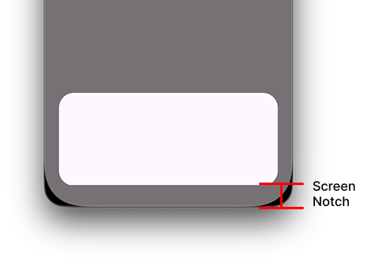
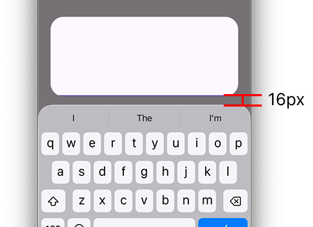

# v0.17.0 Release Notes

This version introduces a `padding` property on `Sheet` and `PagedSheet`, giving you full control over how the sheet content responds to the keyboard, safe areas, or any other insets.

## Context

Previously, `Sheet` and `PagedSheet` offered two boolean flags — `shrinkChildToAvoidDynamicOverlap` and `shrinkChildToAvoidStaticOverlap` — to control whether a sheet automatically resizes its child to avoid the on-screen keyboard or screen notches. While they worked well in many cases, there are still cases those two flags can't cover — for example, a floating sheet with margins where the bottom margin changes depending on whether the keyboard is open.

## What's new?

A `padding` property has been added to `Sheet` and `PagedSheet` widgets to replace the two flags. This change also eliminates the automatic content resizing behavior, so you are now responsible for padding the sheet content to avoid the keyboard and screen notches.

Although it may sound like a downgrade, it enables you to build more complex layouts that couldn't be achieved with the legacy flags. Here's an example of such a layout where the sheet avoids screen notches when first displayed, then shifts itself above the keyboard when it opens while preserving a fixed amount of space between the keyboard and the sheet. Weirdly, this wasn't possible because `shrinkChildToAvoidDynamicOverlap` interfered with `SheetViewport.padding`, completely ignoring the padding when the keyboard was shown. 

|             Keyboard is closed              |                   Keyboard is open                    |
| :-----------------------------------------: | :---------------------------------------------------: |
|  |  |

See [sheet_padding.dart](https://github.com/fujidaiti/smooth_sheets/blob/main/example/lib/tutorial/sheet_padding.dart) for more examples.

### Sheet.padding vs. SheetViewport.padding vs. Padding widget

You might wonder how `Sheet.padding` differs from `SheetViewport.padding` and wrapping the sheet content (`Sheet.child`) with a `Padding` widget from the Flutter SDK. While [this interactive example](https://github.com/fujidaiti/smooth_sheets/blob/main/example/lib/tutorial/sheet_padding.dart) is useful for understanding the differences visually, here's a TL;DR:

- use `Sheet.padding` to inset the content,
- use `SheetViewport.padding` to add margin around the sheet itself, and
- wrapping the content with a `Padding` widget doesn't fit most cases.

## Breaking Changes

The `shrinkChildToAvoidDynamicOverlap` and `shrinkChildToAvoidStaticOverlap` flags on `Sheet` and `PagedSheet` **have been removed**. Please follow the instructions below to migrate from these two flags to the `padding` property. The basic rules are to replace:

- `shrinkChildToAvoidDynamicOverlap: true` with a padding of `MediaQuery.viewInsetsOf(context).bottom`
- `shrinkChildToAvoidStaticOverlap: true` with a padding of `MediaQuery.viewPaddingOf(context).bottom`

### For sheets with `shrinkChildToAvoidDynamicOverlap: true`

You may have enabled `shrinkChildToAvoidDynamicOverlap` to automatically shift the sheet content upward to avoid the keyboard. It was `true` by default, so sheets that don't explicitly disable this flag should also migrate to the `padding` property as follows:

**BEFORE**

```dart
Sheet(
  shrinkChildToAvoidDynamicOverlap: true,
  child: ...,
);
```

**AFTER**

```dart
Sheet(
  padding: EdgeInsets.only(
  	bottom: MediaQuery.viewInsetsOf(context).bottom,
  ),
  child: ...,
);
```

### For sheets with `shrinkChildToAvoidStaticOverlap: true`

Follow this migration guide if you enabled `shrinkChildToAvoidStaticOverlap` to automatically pad the content to avoid screen notches at the bottom. It was `false` by default, so sheets that don't explicitly enable this flag are not affected by this change.

**BEFORE**

```dart
Sheet(
  shrinkChildToAvoidStaticOverlap: true,
  child: ...,
);
```

**AFTER**

```dart
Sheet(
  padding: EdgeInsets.only(
  	bottom: MediaQuery.viewPaddingOf(context).bottom,
  ),
  child: ...,
);
```

### For sheets with both `shrinkChildToAvoidDynamicOverlap: true` and `shrinkChildToAvoidStaticOverlap: true`

**BEFORE**

```dart
Sheet(
  shrinkChildToAvoidDynamicOverlap: true,
  shrinkChildToAvoidStaticOverlap: true,
  child: ...,
);
```

**AFTER**

```dart
Sheet(
  padding: EdgeInsets.only(
    bottom: math.max(
      MediaQuery.viewInsetsOf(context).bottom,
      MediaQuery.viewPaddingOf(context).bottom,
    ),
  ),
  child: ...,
);
```

## Other Breaking Changes

The following properties have also been removed:

- `SheetMetrics.viewportDynamicOverlap`
  - Use `MediaQuery.viewInsetsOf(context).bottom` from descendant widgets of a sheet instead.

- `SheetMetrics.viewportStaticOverlap`
  - Use `MediaQuery.viewPaddingOf(context).bottom` from descendant widgets of a sheet instead.

- `SheetLayoutSpec.viewportDynamicOverlap`
  - Use `MediaQuery.viewInsetsOf(context).bottom` from descendant widgets of a sheet instead.

- `SheetLayoutSpec.viewportStaticOverlap`
  - Use `MediaQuery.viewPaddingOf(context).bottom` from descendant widgets of a sheet instead.

- `SheetLayoutSpec.shrinkContentToAvoidDynamicOverlap`
- `SheetLayoutSpec.shrinkContentToAvoidStaticOverlap`
